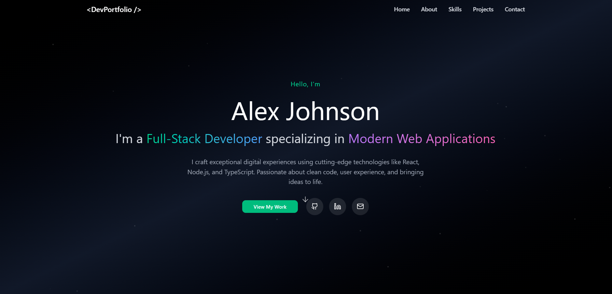

<div align="center">

</div>

# Web Developer Portfolio

A modern, responsive web developer portfolio built with React, Vite, and Radix UI components. This project showcases professional work, skills, and contact information in a sleek, dark-themed design.

## Features

- **Hero Section**: Eye-catching introduction with animated elements
- **About Section**: Personal background and professional summary
- **Skills Section**: Technical skills and competencies
- **Projects Section**: Showcase of notable projects with descriptions
- **Contact Section**: Contact form and social media links
- **Responsive Design**: Optimized for all device sizes
- **Dark Theme**: Modern dark aesthetic with smooth animations
- **Accessibility**: Built with accessibility best practices

## Technologies Used

- **Frontend Framework**: React 18
- **Build Tool**: Vite
- **UI Components**: Radix UI (Accordion, Dialog, Navigation Menu, etc.)
- **Styling**: Tailwind CSS with custom utilities
- **Icons**: Lucide React
- **Animations**: Motion library
- **Forms**: React Hook Form with validation
- **Charts**: Recharts for data visualization
- **Theme Management**: Next Themes for dark/light mode support

## Getting Started

### Prerequisites

- Node.js (version 16 or higher)
- npm or yarn package manager

### Installation

1. Clone the repository:
   ```bash
   git clone https://github.com/BinaryVortex/Web-Developer-Portfolio.git
   cd Web-Developer-Portfolio
   ```

2. Install dependencies:
   ```bash
   npm install
   ```

3. Start the development server:
   ```bash
   npm run dev
   ```

4. Open your browser and navigate to `http://localhost:5173`

### Building for Production

To create a production build:

```bash
npm run build
```

The built files will be in the `dist` directory.

## Project Structure

```
src/
├── components/
│   ├── Navigation.tsx
│   ├── HeroSection.tsx
│   ├── AboutSection.tsx
│   ├── SkillsSection.tsx
│   ├── ProjectsSection.tsx
│   └── ContactSection.tsx
├── styles/
│   └── (custom styles)
├── guidelines/
│   └── (project guidelines)
├── App.tsx
├── main.tsx
├── index.css
└── Attributions.md
```

## Customization

### Personalizing Content

1. **Hero Section**: Update name, title, and tagline in `src/components/HeroSection.tsx`
2. **About Section**: Modify personal information in `src/components/AboutSection.tsx`
3. **Skills**: Add or remove skills in `src/components/SkillsSection.tsx`
4. **Projects**: Update project details in `src/components/ProjectsSection.tsx`
5. **Contact**: Change contact information in `src/components/ContactSection.tsx`

### Styling

- Main styles are in `src/index.css`
- Component-specific styles use Tailwind classes
- Theme colors can be customized in the CSS variables

### Adding New Sections

To add a new section:

1. Create a new component in `src/components/`
2. Import and add it to `src/App.tsx`
3. Update navigation if needed

## Contributing

1. Fork the repository
2. Create a feature branch (`git checkout -b feature/amazing-feature`)
3. Commit your changes (`git commit -m 'Add some amazing feature'`)
4. Push to the branch (`git push origin feature/amazing-feature`)
5. Open a Pull Request

## License

This project is licensed under the MIT License - see the [LICENSE](LICENSE) file for details.

## Acknowledgments

- Original design from Figma Community
- Built using open-source libraries and tools
- See [Attributions.md](src/Attributions.md) for detailed credits

---

*This portfolio template is designed to help web developers showcase their work effectively. Customize it to reflect your unique skills and projects!*
